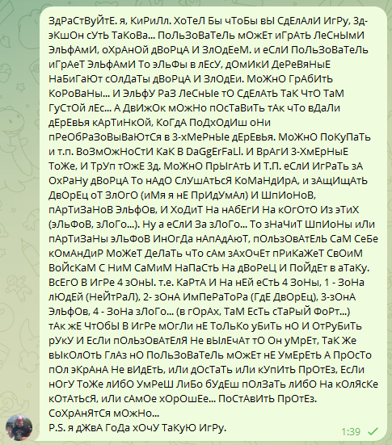

# JokerText

JokerText is a simple JavaScript extension for Telegram that adds playful text transformations to your messages. It currently supports a "jump" style where each alternate character is capitalized, and a "cypher" style that replaces characters with their ASCII codes.

## Features

- **JuMp Style:** Capitalizes every alternate character in the input text.
- **Cypher Style:** Converts each character in the input text to its ASCII code.

